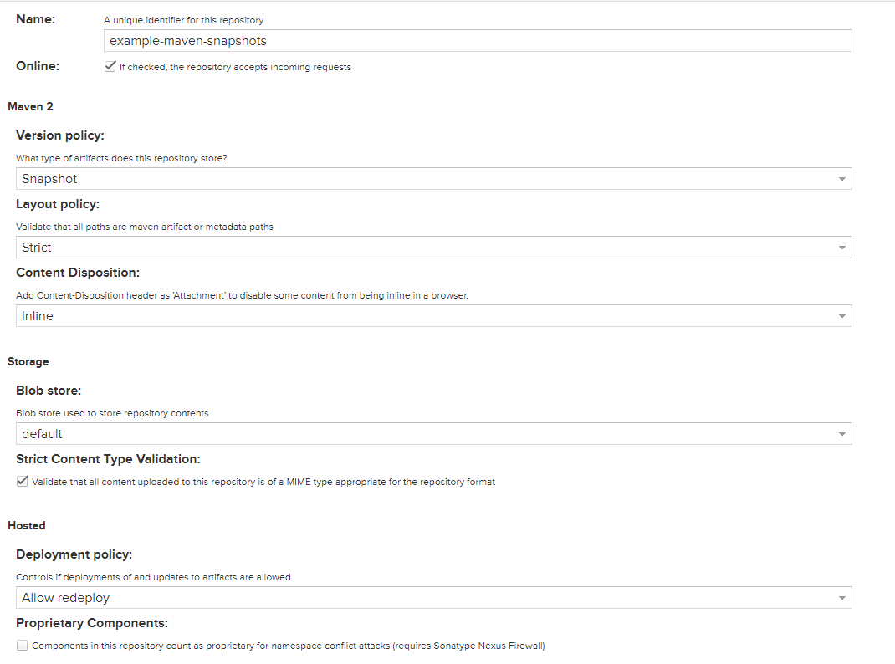

# Java - Multiple Environment

1. Nội dung
    1. Tạo controller
        
        ```python
        package com.example.multiple_environment.multipleenvironment.controller;
        
        import org.springframework.beans.factory.annotation.Value;
        import org.springframework.web.bind.annotation.GetMapping;
        import org.springframework.web.bind.annotation.RequestMapping;
        import org.springframework.stereotype.Controller;
        import org.springframework.ui.Model;
        
        @Controller
        @RequestMapping("/")
        public class HelloController {
        	@Value("${app.title}")
        	private String title;
        	
        	@GetMapping("")
        	public String hello(Model model) {
        		model.addAttribute("title", title);
        		return "index";
        	}
        }
        ```
        
    2. Tạo template
        
        ```python
        <!DOCTYPE HTML>
        <html xmlns:th="http://www.thymeleaf.org">
        <head> 
            <title th:text="${title}"></title> 
        </head>
        <body>
            <h1 th:text="${title}"></h1>
        </body>
        </html>
        ```
        
    3. Thêm maven properties
        
        ```python
        <properties>
        	...
        	<profile>${profile:dev}</profile>
        </properties>
        ```
        
    4. Tạo các spring profile
        - application.properties
            
            ```python
            spring.profiles.active=@profile@
            app.title=Hello world
            server.port=8084
            ```
        
        - application-dev.properties
            
            ```python
            app.title=Dev environment
            server.port=8085
            ```
            
        - application-test.properties
            
            ```python
            app.title=Test environment
            server.port=8086
            ```
            
        - application-prod.properties
            
            ```python
            app.title=Prod environment
            server.port=8087
            ```
            
    5. Build
        
        ```python
        # build with test environment
        $ mvnw -f . -Dprofile=test package
        
        # build with prod environment
        $ mvnw -f . -Dprofile=prod package
        ```
        
    6. Run package
        
        ```python
        $ java -jar ./target/multiple-environment-0.0.1-SNAPSHOT.jar
        ```
        
    7. Kết quả
        
        
        
        

# Jenkins Pipeline And Nexus

1. Nội dung
    1. Tạo `snapshots` repository
        
        
        
        - Được sử dụng để chứa các artifacts được deploy với version tag `-SNAPSHOT` trong file `pom.xml`
    2. Tạo `releases` repository
        
        
        
        - Được sử dụng để chứa các artifacts được deploy khi không có version tag `-SNAPSHOT` thường được thêm version tag `-RELEASE` trong file `pom.xml`
        - `deployment policy: disable redeploy`: Để ngăn chặn việc deploy lại 1 artifact.
    3. Tạo `example-dev` role
        
        
        
    4. Tạo `jenkins-user` user
        
        
        
    5. Cài các plugin `Nexus Artifact Uploader` và `Pipeline Utility Steps` trên Jenkins
    6. Tạo `nexus` credential
        
        
        
        - Với username và password đã tạo phía trên
    7. Add Maven tool
        - *`Dashboard` > `Manage Jenkins` > `Global Tool Configuration` > `Maven`*
        
        
        
    8. Jenkinsfile
        
        ```bash
        pipeline {
            agent any 
            
            tools {
                maven "Maven"
            }
            
            environment {
                GIT_REPOSITORY = "https://github.com/tranvannhan1911/java-multiple-environment.git"
                NEXUS_VERSION = "nexus3"
                NEXUS_PROTOCOL = "https"
                NEXUS_URL = "nexus.tranvannhan1911.tk"
                NEXUS_CREDENTIAL_ID = "nexus"
                NEXUS_REPOSITORY_RELEASE = "example-maven-releases"
                NEXUS_REPOSITORY_SNAPSHOT = "example-maven-snapshots"
            }
            
            stages {
                stage("Checkout"){
                    steps {
                        checkout([$class: 'GitSCM', 
                            branches: [[name: '*/main']],
                            extensions: [[$class: 'CleanCheckout']], // clean workspace after checkout
                            userRemoteConfigs: [[url: GIT_REPOSITORY]]])
                    }
                }
                
                stage("Build"){
                    steps {
                        sh "mvn -f . -Dprofile=$ENV package"
                    }
                }
                
                stage("Publish to Nexus"){
                    steps {
                        script {
                            pom = readMavenPom file: "pom.xml";
                            filesByGlob = findFiles(glob: "target/*.${pom.packaging}");
                            version = pom.version;
                            versionType = version.substring(version.indexOf('-')+1, version.length());
                            artifactPath = filesByGlob[0].path;
                            
                            echo "${filesByGlob[0].name} ${artifactPath} ${filesByGlob[0].directory} ${filesByGlob[0].length} ${filesByGlob[0].lastModified} ${versionType}"
                            
                            artifactExists = fileExists artifactPath;
                            if(artifactExists) {
                                if(versionType == "SNAPSHOT")
                                    nexusRepository = NEXUS_REPOSITORY_SNAPSHOT;
                                else
                                    nexusRepository = NEXUS_REPOSITORY_RELEASE;
                                
                                echo "File: ${artifactPath}, group: ${pom.groupId}, packaging: ${pom.packaging}, version ${pom.version}";
                                result = nexusArtifactUploader(
                                    nexusVersion: NEXUS_VERSION,
                                    protocol: NEXUS_PROTOCOL,
                                    nexusUrl: NEXUS_URL,
                                    groupId: pom.groupId,
                                    version: pom.version,
                                    repository: nexusRepository,
                                    credentialsId: NEXUS_CREDENTIAL_ID,
                                    artifacts: [
                                        [artifactId: pom.artifactId,
                                        classifier: '',
                                        file: artifactPath,
                                        type: pom.packaging],
                                        [artifactId: pom.artifactId,
                                        classifier: '',
                                        file: "pom.xml",
                                        type: "pom"]
                                    ]
                                );
                                
                                if(!result){
                                    error "Upload artifact ${filesByGlob[0].name} fail!";
                                }
                            } else {
                                error "File: ${artifactPath}, could not be found";
                            }
                        }
                    }
                }
            }
        }
        ```
        
    9. Kết quả
        
        
        
2. Tài liệu tham khảo
    1. [https://dzone.com/articles/publishing-artifacts-to-sonatype-nexus-using-jenki](https://dzone.com/articles/publishing-artifacts-to-sonatype-nexus-using-jenki)
    2. [https://www.youtube.com/watch?v=ftTjxztcT14](https://www.youtube.com/watch?v=ftTjxztcT14)
    3. [https://stackoverflow.com/questions/38276341/jenkins-ci-pipeline-scripts-not-permitted-to-use-method-groovy-lang-groovyobject](https://stackoverflow.com/questions/38276341/jenkins-ci-pipeline-scripts-not-permitted-to-use-method-groovy-lang-groovyobject)
    